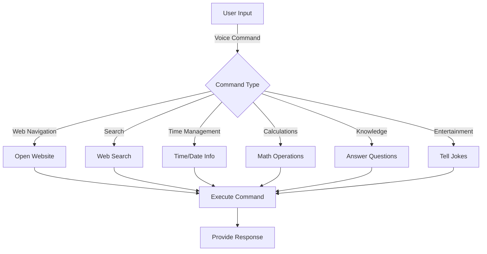

<div align="center">

# 🎙️ T7C Virtual Assistant 🤖

[](https://postimg.cc/0M8Zrpzw)

[](https://www.javascript.com/)
[](https://opensource.org/licenses/MIT)
[](http://makeapullrequest.com)

*Your intelligent, voice-activated digital companion*

[Features](#-features) • [Demo](#-live-demo) • [Installation](#-installation) • [Usage](#-usage) • [Contribute](#-contributing)

</div>

---

## 📘 Table of Contents

- [Overview](#-overview)
- [Features](#-features)
- [Live Demo](#-live-demo)
- [Technologies Used](#-technologies-used)
- [Installation](#-installation)
- [Usage](#-usage)
- [Voice Commands](#-voice-commands)
- [Customization](#-customization)
- [Contributing](#-contributing)
- [License](#-license)
- [Acknowledgements](#-acknowledgements)

## 🌟 Overview

T7C is not just another virtual assistant; it's your gateway to a seamless, voice-controlled digital experience. Harnessing the power of cutting-edge speech recognition and synthesis technologies, T7C transforms the way you interact with your digital world.

<details>
<summary>Why Choose T7C?</summary>

- 🚀 Lightweight and fast
- 🧠 Continuously learning and improving
- 🔒 Privacy-focused design
- 🌈 Customizable to fit your needs
- 🌐 Works across multiple platforms

</details>

## 🎯 Features

| Feature | Description |
|---------|-------------|
| 🗣️ Voice Activation | Interact using natural language |
| 🌐 Web Navigation | Open websites with voice commands |
| 🔍 Intelligent Search | Perform web and Wikipedia searches |
| ⏰ Time Management | Get time, date, and day information |
| 🧮 Basic Calculations | Access calculator and perform math operations |
| 💡 General Knowledge | Ask questions and get informative responses |
| 😄 Entertainment | Enjoy jokes and fun interactions |

## 🖥️ Live Demo

Experience T7C in action: [T7C Live Demo](https://t7c-assistant.vercel.app)


## 🛠️ Technologies Used

<table>
  <tr>
    <td align="center"><br />HTML5</td>
    <td align="center"><br />CSS3</td>
    <td align="center"><br />JavaScript</td>
    <td align="center"><br />Web Speech API</td>
  </tr>
</table>

## 📦 Installation

```bash
# Clone the repository
git clone https://github.com/tanbaycu/T7C-assistant.git

# Navigate to the project directory
cd T7C-assistant

# Open index.html in your preferred browser
# For example, on macOS:
open index.html
```

## 🚀 Usage

1. Launch T7C in a modern web browser
2. Click the microphone icon or say "Hey T7C" to activate
3. Speak your command or question clearly
4. Watch as T7C processes your input and responds

> 💡 **Pro Tip:** For optimal performance, use T7C in a quiet environment and speak clearly.

## 🗣️ Voice Commands

T7C understands a wide array of voice commands. Here's a taste of what you can do:



For a comprehensive list of commands, ask T7C "What can you do?"

## 🎨 Customization

Extend T7C's capabilities by modifying the `takeCommand()` function:

```javascript
function takeCommand(message) {
  // Add your custom command here
  if (message.includes("custom command")) {
    speak("Executing custom command");
    // Your custom logic here
  }
  // ... existing commands ...
}
```

## 🤝 Contributing

We welcome contributions! Here's how you can help:

1. Fork the repository
2. Create your feature branch (`git checkout -b feature/AmazingFeature`)
3. Commit your changes (`git commit -m 'Add some AmazingFeature'`)
4. Push to the branch (`git push origin feature/AmazingFeature`)
5. Open a Pull Request

<details>
<summary>Contribution Guidelines</summary>

- Ensure cross-browser compatibility
- Follow the existing coding style
- Update documentation as necessary
- Add unit tests for new features
- Ensure all tests pass before submitting PR

</details>

## 🙏 Acknowledgements

- [Web Speech API](https://developer.mozilla.org/en-US/docs/Web/API/Web_Speech_API)
- [Font Awesome](https://fontawesome.com)
- [Shields.io](https://shields.io)
- [Mermaid](https://mermaid-js.github.io/mermaid/#/)


## 💜 Contact and Support 24/7
- [Email](mailto:tanbaycu@gmail.com)
- [Facebook](https://facebook.com/tanbaycu.404s)
- [Telegram](https://t.me/tanbaycu)
---


<div align="center">

Developed with 🤍 by [tanbaycu](https://github.com/tanbaycu)

[⬆ Back to Top](#-t7c-virtual-assistant-)

</div>